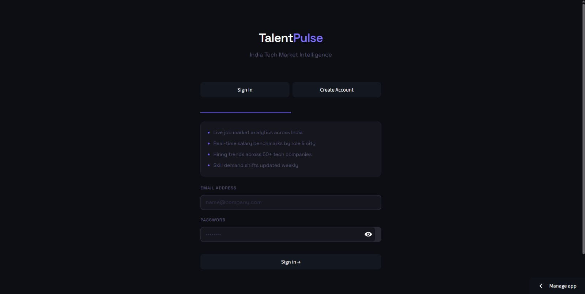
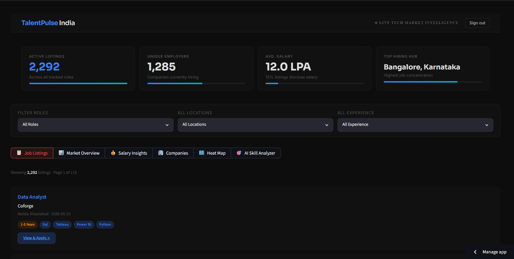
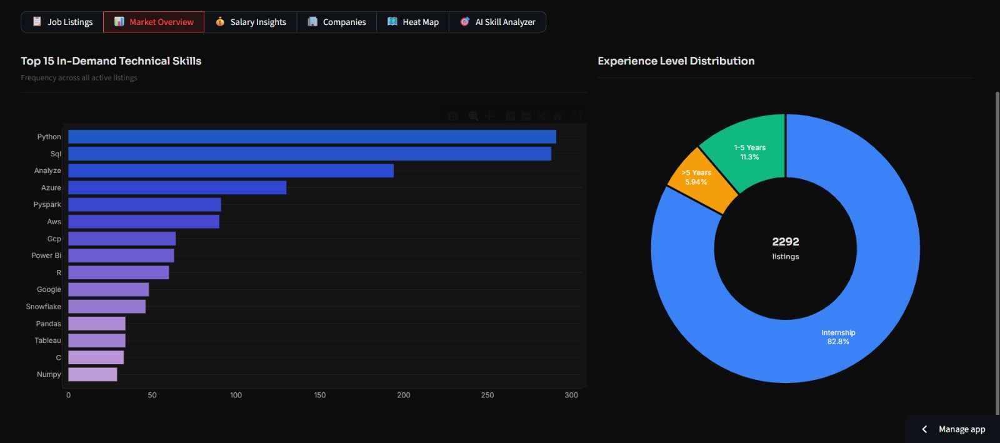
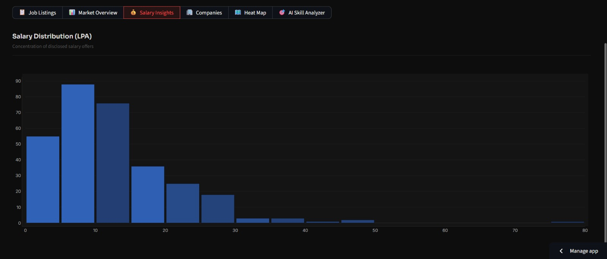
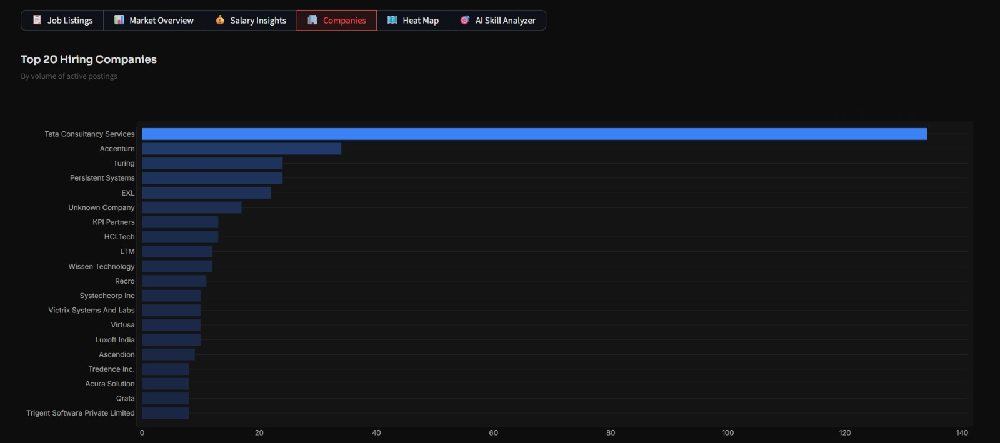
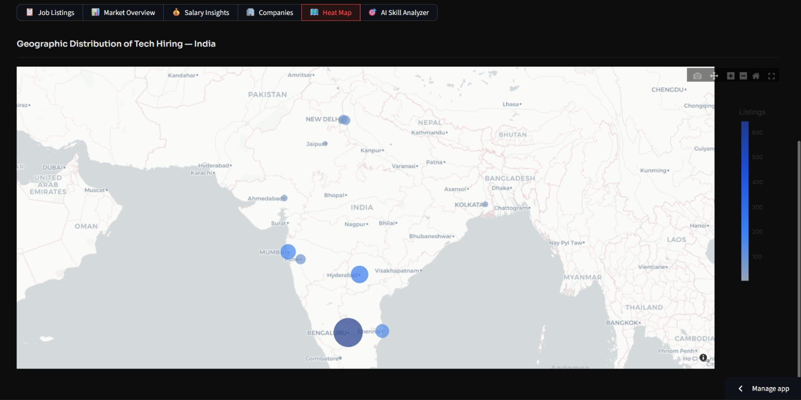
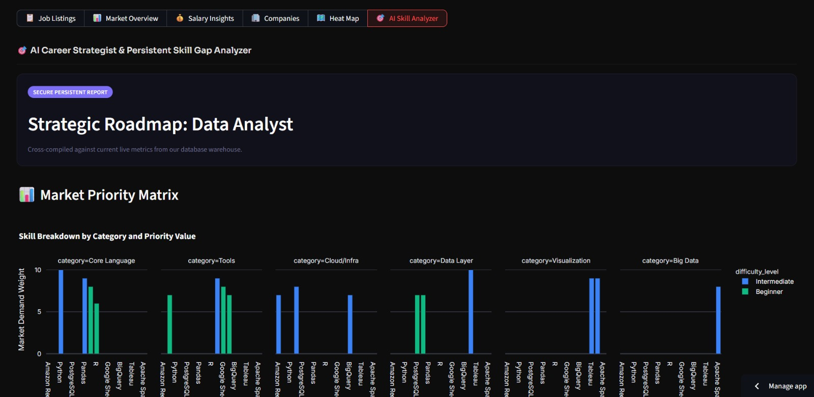
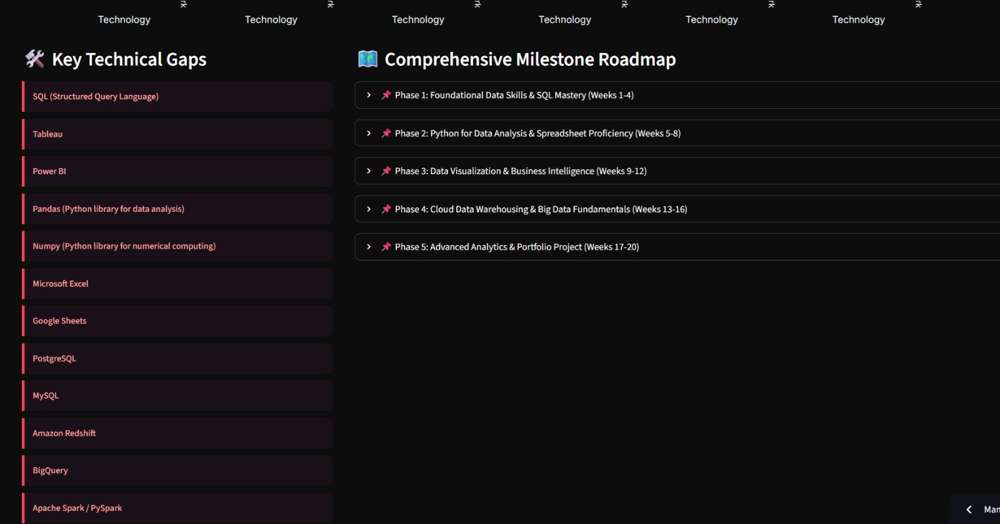

# TalentPulse India — AI Job Market Skill Gap Analytics Platform

A full-stack analytics platform that aggregates live job market data and uses AI to surface in-demand skills, salary benchmarks, and hiring trends across India's tech industry.

### 🔗 [Live Demo](https://ai-skill-gap-analyzer-dsk3cnesubbhphqvhqqycs.streamlit.app/)

> 🍴 This is a fork of a 3-member final-year capstone project, built under faculty guidance. **My contributions:** Core project idea & concept, all data visualizations and dashboard design (Market Overview, Salary Insights, Companies, Heat Map, AI Skill Analyzer, Roadmap), and full project documentation — plus supporting contributions to the codebase.

## 📊 Overview

- Aggregates **2,292+ live job listings** from **1,285+ employers**
- Uses the **Gemini API** for automated skill extraction from job postings and resumes
- Surfaces the **top 15 in-demand skills**, role demand by category, and salary benchmarks (avg. **12.0 LPA**) across India's tech job market

## 🖥️ Dashboards

1. **Market Overview** — high-level hiring trends across roles and regions
2. **Salary Insights** — compensation benchmarks by role and experience level
3. **Companies** — employer-level hiring activity
4. **Heat Map** — geographic demand visualization
5. **AI Skill Analyzer** — Gemini-powered skill extraction and gap detection
6. **Top Skills** — most in-demand skills ranked across listings

## 🛠️ Tech Stack

- **Python**
- **Streamlit** — interactive dashboard framework
- **Gemini API** — AI-based skill extraction
- **Pandas** — data processing

## 📁 Project Structure

```
├── .devcontainer/          # Dev container config
├── .github/workflows/      # CI/CD pipelines
├── utils/                  # Helper modules (incl. Gemini-based skill analyzer)
├── views/                  # Dashboard pages/views
├── database.py             # Database connection & models
├── pipeline.py             # Job data ingestion & processing pipeline
└── requirements.txt        # Python dependencies
```

## 🖼️ Preview

**Sign in**


**Dashboard overview**


**Market overview — top skills & experience distribution**


**Salary insights**


**Top hiring companies**


**Geographic hiring heat map**


**AI Skill Analyzer — market priority matrix**


**AI-generated learning roadmap**


## 🚀 Getting Started

```bash
# Clone the repo
git clone https://github.com/Aryan0588/talentpulse-india.git
cd talentpulse-india

# Install dependencies
pip install -r requirements.txt

# Run the app
streamlit run views/dashboard.py
```

> ⚠️ You'll need a Gemini API key set as an environment variable for the AI skill extraction features to work.

## 👥 Team

Final-year MCA capstone project (Session 2024–26), built collaboratively by a 3-member team — **Aryan**, **Hritwik Sharma**, and **Ravi Ranjan Singh** — under the guidance of Dr. Swati Singh, School of Computer Applications and Technology, Galgotias University.

## 👤 Author (this fork)

**Aryan** — [LinkedIn](#) · [GitHub](https://github.com/Aryan0588)
